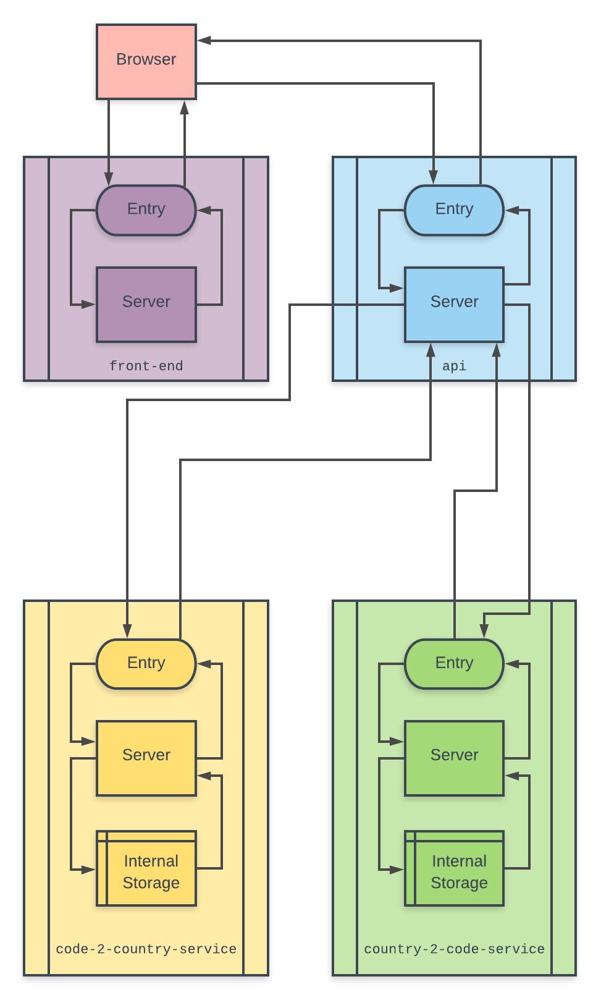
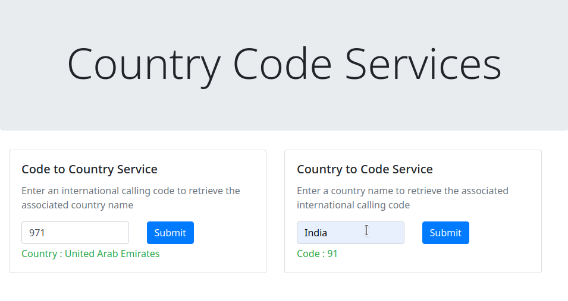

# Microservices

## Problem

To create a simple web application that uses microservices for retrieving country calling code information.

## Architecture

Architecture

The solution is built with 4 microservices:

- [`front-end`](front-end)
- [`api`](api-gateway/)
- [`code-2-country`](code-2-country-service/)
- [`country-2-code`](country-2-code-service/)

The following diagram illustrates the working of the architecture:



## Instructions

Create docker images and containers:

```bash
docker-compose up
```

Visit [http://localhost:8080](http://localhost:8080)

## Screenshot


